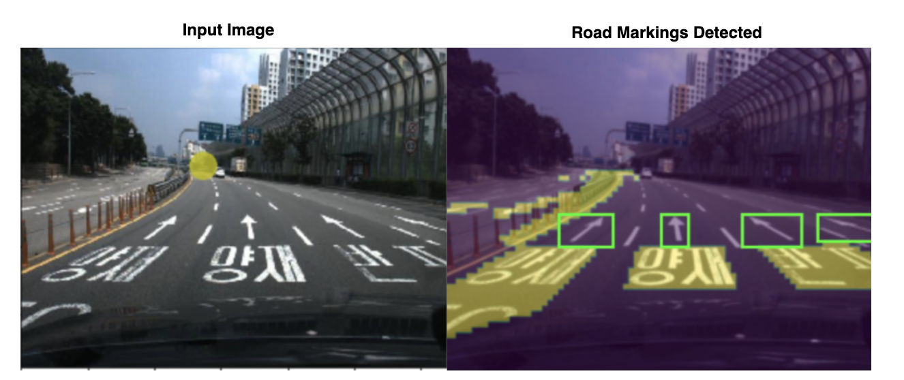
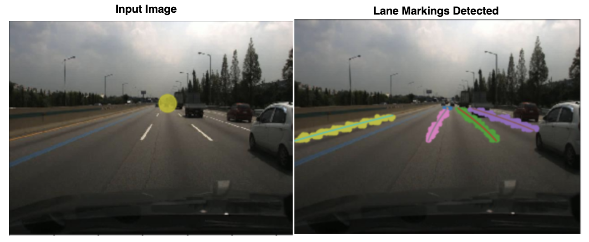

# Road-And-LaneMarking-Detection

</img>
</img>

This repo includes the results for performing road and lane marking detection, using state of the art VPGNet trained on Caltech Lane Dataset.
Source Code and Trained models are not included for copyright reasons.
